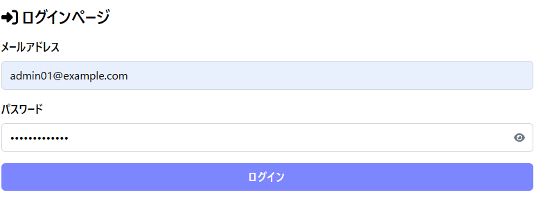
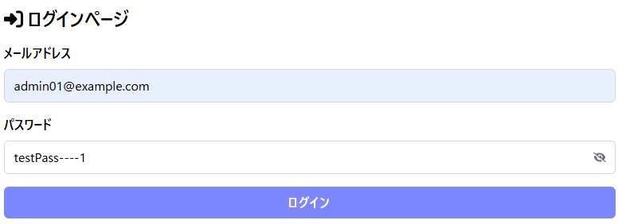

# ウェブアプリセキュリティ学習プロジェクト (My-Sec-Study-App)

このプロジェクトはNext.jsを使用したWebアプリケーションのセキュリティ設計を学ぶための実習用アプリケーションです。

## 📋 プロジェクト概要

セキュアなWebアプリケーション開発の基本原則とベストプラクティスを実践的に学習することを目的としています。

## ✨ 実装済み機能

### 🔐 認証・認可システム

- **JWT ベース認証**: JSON Web Tokenを使用したステートレス認証
- **パスワードハッシュ化**: bcryptjsを使用した安全なパスワード保存
- **セッション管理**: localStorageとSWRを使用したクライアントサイドセッション管理
- **ログイン/ログアウト機能**: 安全な認証フロー
- **ユーザー登録機能**: Server Actionsを使用したサインアップ

### 🛡️ セキュリティ機能

- **入力検証**: Zodスキーマによる厳密な入力バリデーション
- **パスワード可視化切り替え**: UXを考慮したパスワード入力フィールド

  <details>
  <summary>📸 パスワード表示/非表示機能のデモ</summary>

  ### 静止画

  #### パスワード非表示状態

  

  #### パスワード表示状態

  

  ### 動作デモ (GIF)

  

  > **機能説明**: 目のアイコンをクリックすることで、パスワードの表示/非表示を切り替えることができます。これにより、入力確認時の利便性とセキュリティの両立を図っています。

  </details>

- **エラーハンドリング**: セキュリティを考慮したエラーメッセージ
- **HTTPS対応**: 本番環境での安全な通信

### 🎨 UI/UX

- **レスポンシブデザイン**: TailwindCSSによるモダンなUI
- **アクセシビリティ**: aria-labelなどの適切な実装
- **フォームバリデーション**: React Hook Formによるリアルタイム検証
- **ローディング状態**: ユーザーフィードバックの充実

## 🛠️ 技術スタック

### フロントエンド

- **Next.js 15.3.4** - React フレームワーク (App Router)
- **React 19** - UIライブラリ
- **TypeScript 5** - 型安全性
- **TailwindCSS v4** - スタイリング
- **React Hook Form** - フォーム管理
- **SWR** - データフェッチング
- **FontAwesome** - アイコン

### バックエンド

- **Next.js API Routes** - サーバーサイドAPI
- **Prisma** - ORMとデータベース管理
- **SQLite** - 開発用データベース
- **bcryptjs** - パスワードハッシュ化
- **jose** - JWT処理
- **Zod** - スキーマバリデーション

### 開発ツール

- **ESLint** - コード品質管理
- **Prettier** - コードフォーマット
- **TypeScript** - 型チェック

## 🚀 セットアップ手順

### 1. リポジトリのクローン

```bash
git clone <repository-url>
cd my-sec-study-app
```

### 2. 依存関係のインストール

```bash
npm install
```

### 3. 環境変数の設定

```bash
cp .env.example .env
```

`.env`ファイルを編集して必要な環境変数を設定:

```env
DATABASE_URL="file:./dev.db"
JWT_SECRET="your-secret-key-here"
```

### 4. データベースのセットアップ

```bash
# データベーススキーマの適用
npx prisma db push

# シードデータの投入
npx prisma db seed
```

### 5. 開発サーバーの起動

```bash
npm run dev
```

アプリケーションは http://localhost:3000 で利用できます。

## 📁 プロジェクト構造

```
src/
├── app/
│   ├── _components/          # 再利用可能なUIコンポーネント
│   │   ├── Button.tsx
│   │   ├── Header.tsx
│   │   ├── TextInputField.tsx
│   │   └── ErrorMsgField.tsx
│   ├── _contexts/           # React Context (認証など)
│   │   ├── AuthContext.tsx
│   │   └── jwtFetcher.ts
│   ├── _hooks/              # カスタムフック
│   │   └── useAuth.ts
│   ├── _types/              # TypeScript型定義
│   │   ├── UserProfile.ts
│   │   ├── LoginRequest.ts
│   │   └── ApiResponse.ts
│   ├── _actions/            # Server Actions
│   │   └── signup.ts
│   ├── api/                 # API Routes
│   │   ├── auth/
│   │   └── login/
│   ├── login/               # ログインページ
│   └── signup/              # サインアップページ
prisma/
├── schema.prisma            # データベーススキーマ
└── seed.ts                  # シードデータ
docs/
└── images/                  # README用画像ファイル
    ├── README.md            # 画像配置ガイド
    ├── password-hidden.png  # パスワード非表示のスクリーンショット
    ├── password-visible.png # パスワード表示のスクリーンショット
    └── password-toggle-demo.gif # パスワード切り替えデモGIF
```

## 🔧 利用可能なコマンド

```bash
# 開発サーバー起動
npm run dev

# 本番ビルド
npm run build

# 本番サーバー起動
npm start

# リンティング
npm run lint

# データベース操作
npx prisma studio          # データベースGUI
npx prisma db push          # スキーマ適用
npx prisma db seed          # シードデータ投入
npx prisma generate         # クライアント生成
```

## 🎯 学習ポイント

### セキュリティベストプラクティス

1. **パスワードの安全な管理** - bcryptjsによるハッシュ化
2. **JWTの適切な実装** - 有効期限とセキュアな署名
3. **入力検証** - クライアント・サーバー両側での検証
4. **エラーハンドリング** - 情報漏洩を防ぐエラーメッセージ
5. **認証フロー** - 安全なログイン・ログアウト処理

### モダンフロントエンド開発

1. **TypeScript** - 型安全性による品質向上
2. **React Hook Form** - 効率的なフォーム管理
3. **SWR** - データフェッチングとキャッシュ
4. **Server Components vs Client Components** - 適切な使い分け

## 📚 参考テストアカウント

シードデータで以下のテストアカウントが利用できます：

| メールアドレス      | パスワード   | 権限  | 名前        |
| ------------------- | ------------ | ----- | ----------- |
| admin01@example.com | password1111 | ADMIN | 高負荷 耐子 |
| admin02@example.com | password2222 | ADMIN | 不具合 直志 |
| user01@example.com  | password1111 | USER  | 構文 誤次郎 |

## 🔄 開発フロー

### コミットメッセージ規約

```
# ==================== Emojis ====================
# 🎉  :tada: 初めてのコミット（Initial Commit）
# 🔖  :bookmark: バージョンタグ（Version Tag）
# ✨  :sparkles: 新機能（New Feature）
# 🐛  :bug: バグ修正（Bugfix）
# ♻️  :recycle: リファクタリング(Refactoring)
# 📚  :books: ドキュメント（Documentation）
# 🎨  :art: デザインUI/UX(Accessibility)
# 🐎  :horse: パフォーマンス（Performance）
# 🔧  :wrench: ツール（Tooling）
# 🚨  :rotating_light: テスト（Tests）
# 💩  :hankey: 非推奨追加（Deprecation）
# 🗑️  :wastebasket: 削除（Removal）
# 🚧  :construction: WIP(Work In Progress)

# ==================== Format ====================
# :emoji: Subject
#
# Commit body...
```

## 💻 開発環境

- **OS**: Windows 11 24H2
- **Node.js**: v20.17.0
- **エディタ**: Visual Studio Code (推奨)

## 📝 TODO / 今後の実装予定

- [ ] CSRF対策の実装
- [ ] Rate Limiting の追加
- [ ] セッションタイムアウト機能
- [ ] 二要素認証 (2FA)
- [ ] パスワード強度チェック
- [ ] ログ監視機能
- [ ] セキュリティヘッダーの設定
- [ ] 入力サニタイゼーション強化

## 🗓️ 開発履歴

- **2025/06/19** - 🎉 プロジェクト初期化
- **2025/06/29** - ✨ JWT認証システム実装完了
- **2025/06/29** - 🔐 bcryptによるパスワードハッシュ化実装
- **2025/06/29** - 🎨 パスワード表示切り替え機能追加

---

## 📄 ライセンス

このプロジェクトは学習目的で作成されています。
